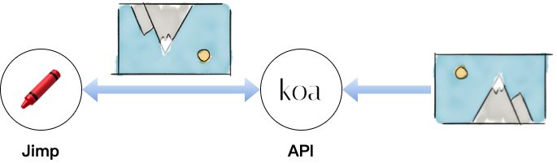

# Image-Stream-Processor

A simple api to flipp images horizontally and vertically.

## How To Build

```
docker network create image-processor

docker-compose up -d
```

## How To Test API

```
curl -H "Content-type: application/json" -d '{
    "type": "flip",
    "url": "https://www.ui.com/microsite/static/media/app-world-diagram.ac485e5a.jpg"
}' 'http://localhost:3000/image/process'
```

## Architecture



###### 標籤: `Node.js` `Koa` `Interview`